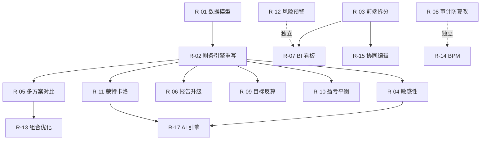

# 升级改造总体方案（M1 → PRD 全量）

> **本文件是改造工作的唯一权威依据（Single Source of Truth）。**
> 任何开发者或 AI 在继续改造前，必须先完整阅读本文件；改造方向、范围、优先级、设计约束均以本文件为准。
> 每完成一个改造项，必须同步更新第 12 章「进度追踪」；如需变更范围或优先级，必须先修改本文件并记录变更原因。

| 项目 | 内容 |
| --- | --- |
| 文档版本 | V1.0 |
| 编写日期 | 2026-08-01 |
| 依据文档 | 《智能投资测算与决策支持系统 软件产品开发需求书.md》V1.0（2026-07-24，下称 **PRD**） |
| UI 基准 | 《智能投资测算与决策支持系统-原型.html》（2026-08-01 生成，单文件高保真原型，下称 **原型**） |
| 工程基线 | M1 闭环版本（2026-07-27 验证通过，见 `docs/handoff.md`） |

---

## 1. 阅读指引

新接手者按以下顺序建立上下文：

1. 本文件第 2 章（工程基线事实快照）——了解现状，**无需重新逐文件探查**；
2. 本文件第 3 章（差距分析）——了解要做什么；
3. 本文件第 4 章（设计红线）——了解怎么做才不跑偏；
4. 本文件第 5、6 章（改造项清单与优先级）——确定当前该做哪一项；
5. 本文件第 12 章（进度追踪）——确认当前进度，从第一个未完成项继续。

关键参考文件路径：

| 内容 | 路径 |
| --- | --- |
| PRD 需求书 | `智能投资测算与决策支持系统 软件产品开发需求书.md` |
| UI 高保真原型 | `智能投资测算与决策支持系统-原型.html`（浏览器直接打开，需联网加载 ECharts CDN） |
| M1 交接说明 | `docs/handoff.md` |
| M1 开发约定 | `docs/dev_notes.md` |
| API 概览 | `docs/api_overview.md` |

---

## 2. 工程基线事实快照（M1 现状）

> 本章为 2026-08-01 对代码逐一核查后的事实记录，后续接手者可直接采信。

### 2.1 技术栈

- 后端：Java 17、Spring Boot 3.3.5、Spring MVC、Spring Security + JJWT、Spring Data JPA、Flyway、H2（dev）/ PostgreSQL 16（prod）、Apache POI、springdoc-openapi、Lombok（pom 已引入但存量代码基本手写 getter/setter）
- 前端：Vue 3 + TypeScript + Vite 6、Vue Router 4、Pinia 2、Element Plus 2.9、ECharts 5.6、Axios 1.7
- 部署：`docker-compose.yml`（postgres / redis / backend / frontend），当前机器无 Docker，以本地开发模式运行
- 后端根包：`com.sis.iids`；API 前缀：`/api/v1`

### 2.2 后端包结构（已存在）

| 包 | 职责 |
| --- | --- |
| `auth` / `security` | 用户、角色、JWT 登录、RBAC |
| `project` | 项目 CRUD |
| `scenario` | 测算方案 + `ParameterSet`（每方案唯一一份参数集） |
| `calculation` | 投资项、融资方案、测算任务、结果与现金流持久化 |
| `engine.financial` | 财务测算引擎（纯计算类，不依赖 Spring） |
| `worker` | 异步测算任务轮询执行（`iids.worker.poll-ms=1000`） |
| `importx` / `report` | Excel 导入 / Excel 报告生成下载 |
| `approval` | 固定三段审批链 |
| `collaboration` | 方案编辑锁 |
| `audit` | 审计事件记录与查询 |
| `common` / `docs` | 统一响应与异常、OpenAPI 配置 |

### 2.3 财务引擎现状（`engine.financial`，改造的核心对象）

- `FinancialInput` 字段：constructionYears、horizonYears、wacc、taxRate、depreciationYears、residualRate、pricePerUnit、unitCost、annualOutput、fixedOperatingCost、constructionInvestment、workingCapital、interestDuringConstruction、equityRatio、loanRatio、loanInterestRate、loanTermYears、constructionSchedule。
- `FinancialEngine.calculate()` 的简化口径（**与 PRD 的差距根源**）：
  - 收入 = pricePerUnit × annualOutput；经营成本 = unitCost × annualOutput + fixedOperatingCost（单一产量口径，无成本分项）；
  - 折旧 = 建设投资 × (1−残值率) ÷ 折旧年限（仅年限平均法）；
  - 利息 = 总投资 × loanRatio × loanInterestRate（**每年恒定，无还本计划**）；
  - 税 = max(利润,0) × taxRate；
  - **全部总投资放在第 0 期一次性流出**；`constructionSchedule` 仅校验条数，未真正参与分年现金流；
  - 流动资金在最后一年回收；
  - IRR 用二分法（区间 −0.9999~10，迭代 100 次）；NPV/ROI/资本金净利润率/静态与动态回收期已计算；
  - 数值约定：`MathContext(20, HALF_UP)`，输出 `scale=4`。
- 持久化：`cash_flow_row` 仅有 inflow/outflow/net/discounted/cumulative + `statement_type` 字段（结构已支持三类报表，引擎目前只生成一类）；`calculation_result` 已含 `formula_version`、`engine_version`、`input_hash`（结果溯源字段已存在）。
- `ReportService` 当前只输出 Excel 两个 sheet（指标汇总、现金流量表），无 Word/PDF、无结构化分析报告。

### 2.4 审批 / 审计 / 安全现状

- `ApprovalService` 审批链**硬编码**：SUBMIT → REVIEW（财务复核）→ APPROVAL（项目经理终审）→ APPROVED/REJECTED；无流程定义表、无条件分支。
- `AuditService.record()` 为普通 insert，字段 action/targetType/targetId/beforeValue/afterValue，**无防篡改机制**。
- `SecurityConfig`：`POST /api/v1/auth/login` 放行；`/h2-console/**` 放行；`/api/v1/admin/**` 需 ADMIN；其余 `/api/v1/**` 需登录；`@EnableMethodSecurity` + `@PreAuthorize` 做角色控制。
- PRD 五角色已通过 `V3__prd_roles_seed.sql` 入库：INVESTMENT_ANALYST、FINANCE_SPECIALIST、TECHNICAL_ENGINEER、PROJECT_MANAGER、SYSTEM_ADMINISTRATOR（兼容旧角色 ANALYST、ADMIN）。
- 测试账号（密码均 `Password123!`）：investment_analyst / finance_specialist / technical_engineer / project_manager / admin。

### 2.5 前端现状

- 路由仅 2 条：`/login`、`/`（`frontend/src/router/index.ts`）。
- `views/WorkbenchHome.vue`（239 行）单文件承载 6 个 Tab：项目管理 / 测算方案 / 测算输入 / 测算与报表 / 流程治理 / 审计日志。
- `layouts/WorkbenchLayout.vue` 侧边栏菜单：projects / calculation / reports / approval / audit。
- `components/MetricChart.vue` 为唯一图表组件（指标柱状图）。
- `shared/api/http.ts` 提供 `apiGet/apiPost/apiPut/apiDelete/apiDownload` 统一封装；`shared/i18n/display.ts` 集中中文展示映射；`stores/auth.ts` 管理登录态（token 存 localStorage `iids.auth.token`）。
- 构建警告：主 chunk >500 kB；npm audit 报 5 个漏洞（未强制修复）。

### 2.6 数据库现状

- 迁移文件：`V1__init_schema.sql`、`V2__auth_seed.sql`、`V3__prd_roles_seed.sql`。
- 表（17 张）：sys_user、sys_role、sys_user_role、project、scenario、parameter_set、investment_item、financing_plan、calculation_task、calculation_result、cash_flow_row、report_document、approval_instance、approval_record、edit_lock、audit_event、import_job。
- `project.tags` 为逗号分隔字符串（500 字）；无归档状态、无标签表。

### 2.7 验证命令（每次改造后必须执行）

```powershell
cd E:\SIS\backend && mvn -q test      # 后端测试（含 OpenAPI 契约测试）
cd E:\SIS\frontend && npm run build   # 前端类型检查 + 构建
```

---

## 3. 需求差距分析

### 3.1 覆盖总表

| PRD 模块 | 优先级 | M1 现状 | 差距 |
| --- | --- | --- | --- |
| FR-01-01 投资估算与资金筹措 | P0 | 投资项/融资方案可录入，无分项合计校验、无贷款比例上限校验、无分期计划 | 中 |
| FR-01-02 成本费用与利润流向 | P0 | 单一产量成本模型，无成本分项、无折旧政策选择、无利润流向数据 | 大 |
| FR-01-03 标准化财务模型 | P0 | NPV/IRR/回收期/ROI/资本金净利润率已有；建设期不分年、利息不还本、口径过于简化 | 大 |
| FR-01-04 三类现金流量表及图表 | P0 | 仅一类现金流；无趋势图；无资本金/财务计划报表 | 大 |
| FR-01-05 目标反算 | P1 | 无 | 全缺 |
| FR-01-06 一键测算与报告生成 | P0 | 有异步测算 + Excel 导出雏形；缺结构化报告、PDF/Word、模板复用 | 中 |
| FR-02-01 敏感性分析 | P0 | 无 | 全缺 |
| FR-02-02 盈亏平衡 | P1 | 无 | 全缺 |
| FR-02-03 蒙特卡洛概率分析 | P1 | 无 | 全缺 |
| FR-02-04 智能风险预警 | P1 | 无 | 全缺 |
| FR-03-01 多方案横向对比 | P0 | 无（数据模型上多方案已存在，缺对比聚合与页面） | 中 |
| FR-03-02 组合优化 | P1 | 无 | 全缺 |
| FR-03-03 项目库与知识沉淀 | P1 | 项目 CRUD 已有；无归档、标签体系、复盘视图 | 中 |
| FR-04-01 BI 仪表盘 | P0 | 无 | 全缺 |
| FR-04-02 跨部门协同编辑 | P1 | 仅后端编辑锁；无在线状态、变更时间线、评论 | 大 |
| FR-04-03 权限与合规 | P0 | 固定权限矩阵 + 固定审批链 + 普通审计日志；缺配置化与日志防篡改 | 中 |
| FR-05 AI 决策引擎 | P2 | 无（历史运营库也完全缺失） | 全缺 |
| 非功能（性能/防篡改/私有化） | — | 异步任务已有；其余未验证或未实现 | 中 |

### 3.2 差距根源（两条）

1. **财务引擎口径过简**：2.3 节列出的简化假设使成本瀑布图、利润流向、三类报表、敏感性、反算、蒙特卡洛全部失去数据基础。财务引擎重写是所有后续功能的关键路径。
2. **前端单页形态**：路由只有 2 条，无法承载原型中的 10 个业务页面，必须先拆分再增量开发。

---

## 4. 设计红线（一致性约束，必须遵守）

> 以下红线用于保证多人/多 AI 接力时产出一致。违反红线的实现应被视为不合格。

- **R1 引擎解耦**：所有计算引擎放 `com.sis.iids.engine.*`（新增 `engine.risk`、`engine.portfolio`），为**不依赖 Spring/JPA 的纯计算类**；Service 层负责组装输入、调用引擎、持久化结果。AI 引擎（FR-05）同理解耦，预留模型版本管理。
- **R2 数值规范**：金额/比率一律 `BigDecimal`，计算用 `MathContext(20, HALF_UP)`，输出 `scale=4`；禁止用 double 传递金额（IRR 内部迭代可用 double，返回前转 BigDecimal）。
- **R3 API 规范**：新接口挂 `/api/v1`；普通 JSON 返回 `ApiResponse{code,message,data}`；业务异常用 `BusinessException + ErrorCode`，消息用中文；下载类接口可直接返回 `ResponseEntity<byte[]>`。
- **R4 审计留痕**：所有新增业务写操作必须 `auditService.record(...)`（action/targetType/targetId/beforeValue/afterValue），action 用英文大写下划线（如 `SENSITIVITY_RUN_CREATED`）。
- **R5 契约同步**：新增/改名核心接口时，同步更新 `OpenApiContractTest` 与 `docs/api_overview.md`。
- **R6 迁移纪律**：Flyway 只增不改——从 `V4__*.sql` 起递增，**禁止修改 V1~V3**；DDL 需同时兼容 H2 与 PostgreSQL（避免 PG 专有语法）。
- **R7 前端规范**：统一使用 `http.ts` 封装，不在组件内自建 Axios；中文文案映射集中放 `shared/i18n/display.ts`；TS 类型在 `shared/types/` 与后端 DTO 对齐；图表用 ECharts；组件库用 Element Plus。
- **R8 角色口径**：权限判断使用 PRD 五角色常量（含 ADMIN/SYSTEM_ADMINISTRATOR），新接口 `@PreAuthorize` 的角色清单参照 `docs/api_overview.md` 的权限矩阵，前台禁用与后台鉴权必须同时做。
- **R9 异步任务**：耗时计算（蒙特卡洛、组合优化等）复用 `CalculationWorker` 的异步任务模式（任务表 + 进度 + 状态机），禁止在 HTTP 请求线程内同步执行长计算。
- **R10 UI 基准**：页面信息架构、图表类型（热力图/瀑布图/帕累托散点/直方图/累计概率曲线等）以原型 HTML 为准；视觉实现用 Element Plus + ECharts 等价还原，不要求像素级一致。
- **R11 可复现**：蒙特卡洛等随机计算必须支持固定随机种子，种子随任务入库存储。
- **R12 可追溯**：测算结果必须可追溯到参数集版本、公式版本、引擎版本（沿用 `calculation_result` 现有三字段，新引擎结果同样落地这三项）。

---

## 5. 改造项总清单（18 项）

> 规模口径（粗略推断）：S < 1 周；M = 1~2 周；L = 2~4 周；XL > 4 周。

### T1 地基改造

**R-01 数据模型扩展与迁移**（规模 M，无依赖）
- 新增/修改表详见第 7 章；产出 `V4__*.sql` 起的迁移脚本与对应 JPA 实体。
- 验收：H2 与 PostgreSQL 两种 profile 下迁移均成功；`mvn -q test` 通过。

**R-02 财务引擎重写**（规模 XL，依赖 R-01；**全项目关键路径**）
- 投资估算：建设投资（建筑工程费/设备购置及安装费/其他费用分项）+ 建设期利息 + 流动资金三级结构；分项合计 = 总投资强校验；贷款比例上限可配置校验（FR-01-01）。
- 建设期支持按 `constructionSchedule` 分年流出（修复当前仅校验不使用的问题）。
- 成本费用：外购原材料及燃料动力、人工及制造费用、折旧、摊销、财务费用分项；折旧政策可选（年限平均法/双倍余额递减法/年数总和法）且留痕（FR-01-02）。
- 融资：贷款还本付息计划（等额本金/等额本息/到期一次还本），利息随本金余额递减（替换当前恒定利息）。
- 输出：利润流向分解数据（收入→税金→成本→折旧摊销→财务费用→利润总额→所得税→净利润，供瀑布图）；三类现金流表（项目投资/资本金/财务计划，利用 `cash_flow_row.statement_type`）；指标集沿用并补充达产年口径（FR-01-03/04）。
- 同步扩展 `ParameterSet`（成本分项、折旧政策、税率梯度、还款方式）与 `FinancialEngineTest`（标准算例回归，对标验收"偏差 ≤ 1‰"）。

**R-03 前端路由拆分与状态重构**（规模 M，无依赖）
- 路由按第 9 章规划拆 10 个页面；`WorkbenchHome.vue` 拆解为独立 views；Pinia 按域建 store（project/scenario/calculation/risk 等）；公共图表组件收拢到 `components/charts/`。
- 红线：保持 `http.ts` 封装与现有 API 类型不变，只拆结构不改业务逻辑（dev_notes 第 6.3 节的既定方针）。

### T2 P0 功能补全

**R-04 敏感性分析引擎 + 热力图**（规模 L，依赖 R-02）
- 支持售价/成本/投资/工期等变量的单因素与多因素（叠加数量可配置）网格化重算；输出敏感性系数、临界值（NPV=0 插值）、二维矩阵；前端 ECharts 热力图 + 龙卷风图（FR-02-01）。

**R-05 多方案横向对比**（规模 S，依赖 R-02）
- 同项目多方案最新成功结果的指标聚合对比矩阵（NPV/IRR/回收期/资本金净利润率/风险占位），输出排序建议；前端对比表格 + 最优值高亮（FR-03-01）。

**R-06 一键测算与报告升级**（规模 M，依赖 R-02）
- 报告内容结构化：项目概况、指标摘要、三类报表、图表、风险结论、建议；引用参数集版本/公式版本/输入哈希；支持模板复用与二次编辑后的导出；导出格式 Excel + PDF（PDF 选型见第 13 章待决策 D3）（FR-01-06）。

**R-07 BI 仪表盘**（规模 M，依赖 R-03）
- 组合级聚合接口（项目数、加权 IRR、总 NPV、预警计数）+ KPI 卡、NPV-IRR 气泡图、阶段分布饼图、行业条形图、风险信号灯、待办列表；支持筛选下钻；首屏 ≤ 3 秒（FR-04-01 + 性能 5.1）。

**R-08 审计日志防篡改**（规模 S，无依赖，可任意时间插入）
- `audit_event` 增加 `prev_hash`/`hash`（SHA-256 链式哈希，内容含 action/target/time/前后值）；提供链校验接口；后台查询页展示校验状态（FR-04-03 约束"日志不可篡改"，验收"日志完整率 100%"）。

### T3 P1 能力建设

**R-09 目标反算求解器**（规模 M，依赖 R-02）
- 给定目标 IRR/NPV/回收期，二分迭代反算售价/投资额/产量/单位成本之一；输出临界值、敏感性说明、适用边界与假设声明（FR-01-05）。

**R-10 盈亏平衡分析**（规模 S，依赖 R-02）
- BEP 产量/产能利用率/售价三口径 + 盈亏平衡图（FR-02-02）。

**R-11 蒙特卡洛概率分析**（规模 L，依赖 R-02）
- 三角/正态/自定义分布配置；≥10000 次抽样；随机种子可配置入库（红线 R11）；输出期望值、NPV>0 概率、VaR(95%)、直方图、累计概率曲线；异步执行 ≤ 1 分钟（FR-02-03 + 性能 5.1）。

**R-12 智能风险预警**（规模 M，相对独立，可并行）
- 阈值规则表（变量/区间/级别/策略建议，管理员可配置）；监控数据源手动录入 + 接口接入（失败降级）；红黄绿灯状态 + 预警事件留痕 + 消息推送订阅（FR-02-04）。

**R-13 组合优化**（规模 L，依赖 R-05）
- 资金池/人力等硬约束下 0-1 整数规划求 Top-N 组合；输出组合 NPV、风险分散度、帕累托前沿（NPV—风险）、求解解释（含影子价格说明）；LP 求解器选型见第 13 章待决策 D1（FR-03-02）。

**R-14 BPM 可配置审批流**（规模 L，依赖现有 approval）
- 审批流定义表 + 节点定义表（节点角色、条件规则如"参数调整 >±5% 升级投委会"）；配置界面；现有固定三段链作为默认模板迁移入库；流程追踪时间线（FR-04-03）。

**R-15 协同编辑实时化**（规模 XL，依赖 R-03）
- 在线状态、变更时间线（版本 v N 递增）、评论 @ 提及、字段级锁定/冲突合并；推送方案见第 13 章待决策 D2；编辑锁升级为字段级（FR-04-02）。

**R-16 项目库与知识沉淀**（规模 M，相对独立）
- 项目归档状态、标签表（替代逗号字符串）、多维检索筛选、已投运项目复盘视图（计划 vs 实际偏差）（FR-03-03）。

### T4 P2 前瞻与收尾

**R-17 AI 决策引擎**（规模 XL，依赖 R-02/R-11 产出物与历史运营库）
- 历史运营数据库（已投项目实际运营数据，校验后入库）；智能参数推荐（折旧/税率/WACC 区间 + 依据来源）；历史数据反哺（偏差率注入敏感性区间）；智能打分（特征提取、评分排序、"建议立项/暂缓"标签，模型可解释、不替代人工决策）；模型版本表；独立模块解耦（FR-05）。

**R-18 非功能收口**（规模 M，贯穿全程、验收前集中完成）
- 性能压测对标 PRD 5.1（测算 ≤3 分钟、蒙特卡洛 ≤1 分钟、看板 ≤3 秒）；PostgreSQL 集成测试；Playwright E2E（登录→建项目→建方案→测算→报告下载）；Docker 环境实跑验证；npm audit 5 项评估处理；前端 chunk 拆分优化。

---

## 6. 优先级与实施顺序

排序原则：**阻塞优先**（被依赖最多的地基先行）→ **验收导向**（P0 100% > P1 ≥90% > P2 按里程碑）→ **性价比调节**（同优先级下低成本项提前）。

| 梯队 | 顺序 | 改造项 | PRD 优先级 | 依赖 |
| --- | --- | --- | --- | --- |
| T1 地基 | 1 | R-01 数据模型迁移 | — | 无 |
| T1 地基 | 2 | R-02 财务引擎重写 | P0 | R-01 |
| T1 地基 | 3 | R-03 前端路由拆分 | — | 无（与 1、2 并行） |
| T2 P0 | 4 | R-04 敏感性分析 | P0 | R-02 |
| T2 P0 | 5 | R-05 多方案对比 | P0 | R-02 |
| T2 P0 | 6 | R-06 报告升级 | P0 | R-02 |
| T2 P0 | 7 | R-07 BI 仪表盘 | P0 | R-03 |
| T2 P0 | 8 | R-08 审计防篡改 | P0（约束） | 无（可随时插入） |
| T3 P1 | 9 | R-09 目标反算 | P1 | R-02 |
| T3 P1 | 10 | R-10 盈亏平衡 | P1 | R-02 |
| T3 P1 | 11 | R-11 蒙特卡洛 | P1 | R-02 |
| T3 P1 | 12 | R-12 风险预警 | P1 | 独立，可并行 |
| T3 P1 | 13 | R-13 组合优化 | P1 | R-05 |
| T3 P1 | 14 | R-14 BPM 审批流 | P0 壳/P1 实 | 现有 approval |
| T3 P1 | 15 | R-15 协同编辑 | P1 | R-03 |
| T3 P1 | 16 | R-16 项目库沉淀 | P1 | 独立，可并行 |
| T4 | 17 | R-17 AI 引擎 | P2 | R-02、R-11 |
| T4 | 18 | R-18 非功能收口 | — | 全程贯穿 |

依赖关系：



并行建议：T1 完成后，后端（R-04/05/06/09/10/11）与前端（R-07 及后续页面）可两条线并行；R-08、R-12、R-16 为独立项，可由第三人随时穿插。

---

## 7. 数据模型变更规划（V4+ 迁移）

> 细粒度 DDL 在各改造项详细设计时确定，此处登记规划口径，防止遗漏。红线 R6：只增不改。

| 序号 | 表/变更 | 服务改造项 | 要点 |
| --- | --- | --- | --- |
| 1 | `investment_item` 加 `parent_id`、分项编码 | R-02 | 支持三级投资估算树 |
| 2 | 新增 `cost_item`（成本分项：类别/金额/年份/来源） | R-02 | 支撑成本瀑布图 |
| 3 | `parameter_set` 加折旧政策、还款方式、税率梯度（JSON） | R-02 | 政策可选且留痕 |
| 4 | 新增 `sensitivity_run` / `sensitivity_cell`（或矩阵 JSON 列） | R-04 | 波动区间、步长、结果矩阵 |
| 5 | 新增 `reverse_run`（目标/变量/边界/求解结果） | R-09 | 反算留痕 |
| 6 | 新增 `monte_carlo_run`（分布参数 JSON、种子、次数、统计结果 JSON） | R-11 | 种子必须入库（红线 R11） |
| 7 | 新增 `risk_rule` / `risk_alert_event` | R-12 | 阈值规则与预警留痕 |
| 8 | 新增 `portfolio_run` / `portfolio_member` | R-13 | 约束 JSON、目标权重、Top-N 结果 |
| 9 | 新增 `approval_flow_def` / `approval_node_def`；`approval_instance` 加 `flow_def_id` | R-14 | 固定链作为默认模板入库 |
| 10 | `audit_event` 加 `prev_hash`、`hash` | R-08 | 链式哈希 |
| 11 | `project` 加归档状态；新增 `project_tag` / `project_tag_rel` | R-16 | 替代逗号字符串 |
| 12 | 新增 `collab_comment` / `collab_change`；`edit_lock` 加字段级锁标识 | R-15 | 协同留痕 |
| 13 | 新增 `historical_operation`（已投项目实际运营数据） | R-17 | AI 反哺数据源 |
| 14 | 新增 `ml_model_version` / `ai_score_result` | R-17 | 模型版本管理 |

---

## 8. 后端包结构规划

新增包（存量包保持不动）：

| 包 | 职责 | 改造项 |
| --- | --- | --- |
| `engine.risk` | 敏感性、BEP、蒙特卡洛（纯计算） | R-04/10/11 |
| `engine.portfolio` | 组合优化求解（纯计算） | R-13 |
| `engine.reverse` | 目标反算求解（纯计算，可并入 engine.risk 视复杂度定） | R-09 |
| `risk` | 风险分析任务编排、阈值规则、预警事件（Service/Controller/持久化） | R-04/10/11/12 |
| `comparison` | 多方案对比聚合 | R-05 |
| `portfolio` | 组合优化任务编排 | R-13 |
| `dashboard` | 看板聚合查询 | R-07 |
| `bpm` | 审批流定义与运行时（现有 approval 演进或并存） | R-14 |
| `collab` | 评论/变更/在线状态（现有 collaboration 扩展） | R-15 |
| `ai` | AI 推荐/反哺/打分（P2，独立模块） | R-17 |

---

## 9. 前端路由与页面规划（对照原型）

| 路由 | 页面 view | 原型页面 | 主要 FR |
| --- | --- | --- | --- |
| `/login` | LoginView（存量） | — | — |
| `/dashboard` | DashboardView | 工作台看板 | FR-04-01 |
| `/projects` | ProjectListView | 项目库 | FR-03-03 |
| `/projects/:id/scenarios` | ScenarioView（可并入项目详情） | 项目库→方案 | FR-01 录入 |
| `/calculation` | CalculationView（6 步流程 + 5 Tab） | 财务测算 | FR-01 全部 |
| `/risk` | RiskAnalysisView（4 Tab） | 风险分析 | FR-02 全部 |
| `/compare` | ComparisonView | 方案比选 | FR-03-01/02 |
| `/reports` | ReportCenterView | 报告中心 | FR-01-06 |
| `/ai` | AiEngineView | AI 决策引擎 | FR-05 |
| `/collab` | CollabView | 协同编辑 | FR-04-02 |
| `/approval` | ApprovalCenterView | 审批中心 | FR-04-03 |
| `/admin` | AdminView | 权限与合规 | FR-04-03 |

组件约定：`components/charts/` 下封装 HeatmapChart、WaterfallChart、ParetoChart、DistributionChart、CumulativeChart、BubbleChart 等 ECharts 包装组件；存量 `MetricChart.vue` 迁入该目录。

---

## 10. 接口规划（草案，实现时以 OpenAPI 契约为准）

| 模块 | 方法与路径（提案） |
| --- | --- |
| 敏感性 | `POST /api/v1/scenarios/{id}/sensitivity-runs`、`GET /api/v1/sensitivity-runs/{runId}` |
| 目标反算 | `POST /api/v1/scenarios/{id}/reverse-runs`、`GET /api/v1/reverse-runs/{runId}` |
| 蒙特卡洛 | `POST /api/v1/scenarios/{id}/monte-carlo-runs`、`GET /api/v1/monte-carlo-runs/{runId}` |
| 盈亏平衡 | `GET /api/v1/scenarios/{id}/break-even` |
| 多方案对比 | `GET /api/v1/projects/{id}/comparison` |
| 组合优化 | `POST /api/v1/portfolio-runs`、`GET /api/v1/portfolio-runs/{runId}` |
| 风险预警 | `CRUD /api/v1/risk-rules`、`GET /api/v1/risk-alerts`、`POST /api/v1/risk-alerts/{id}/ack` |
| 仪表盘 | `GET /api/v1/dashboard/summary`（带筛选参数） |
| BPM | `CRUD /api/v1/admin/approval-flows`（ADMIN） |
| 协同 | `GET/POST /api/v1/scenarios/{id}/comments`、`GET /api/v1/scenarios/{id}/changes`、推送通道（D2 决策） |
| AI（P2） | `GET /api/v1/scenarios/{id}/ai/param-recommendation`、`GET /api/v1/projects/{id}/ai/score` |

---

## 11. 验收对标（PRD 第 8 章 → 验证方式）

| PRD 验收指标 | 验证方式 | 关联改造项 |
| --- | --- | --- |
| P0 功能 100% 实现并通过用例 | 后端集成测试 + E2E 清单 | R-02/04/05/06/07/08 |
| P1 ≥ 90% | 同上 | R-09~R-16 |
| 测算偏差 ≤ 1‰（对标准算例/第三方模型） | `FinancialEngineTest` 标准算例回归 | R-02 |
| 审计日志完整率 100%、越权测试 0 通过 | `RbacIntegrationTest` 扩展 + 哈希链校验接口 | R-08 |
| 性能（测算 ≤3min、蒙特卡洛 ≤1min、看板 ≤3s） | 压测记录 | R-11、R-07、R-18 |
| 交付用户/管理员/API 文档 | 更新 docs 三件套 + Swagger | R-18 |

---

## 12. 进度追踪（每完成一项即更新）

> 状态口径：⬜ 未开始 / 🔵 进行中 / ✅ 已完成（附完成日期与验证结果）。

| 序号 | 改造项 | 状态 | 完成日期 | 验证记录 |
| --- | --- | --- | --- | --- |
| — | 差距评估与本方案编制 | ✅ | 2026-08-01 | 本文件 |
| — | R-01+R-02 详细设计 | ✅ | 2026-08-01 | `docs/design/R01-R02-financial-engine.md`（待评审） |
| R-01 | 数据模型扩展与迁移 | ✅ | 2026-08-01 | V4 迁移 + 6 实体（含新增 CostItem/Repository）；`mvn test` 41/41 通过，Flyway 校验 4 迁移、schema 升至 v4 |
| R-02 | 财务引擎重写 | ✅ | 2026-08-01 | 设计任务 1~8 全部完成：引擎 v2 + 服务层 + 新 API（投资/成本分项 CRUD、investment-summary、statements、profit-flow、loan-schedule）+ OpenAPI 契约 + 前端 `display.ts`/表单。`mvn test` 52/52 通过，前端 `vue-tsc --noEmit` + `npm run build` 通过 |
| R-03 | 前端路由拆分 | ✅ | 2026-08-02 | `WorkbenchHome.vue` 拆为 9 个独立 views（Projects/Scenarios/Inputs/Calculation/RiskAnalysis/Comparison/Reports/Governance/Audit）+ Pinia `workbench` store（跨页共享项目/方案选中、测算任务、表单，解决原 Tab 切换状态丢失）+ 路由 10 条（懒加载分包）+ 布局菜单改路由驱动 + `MetricChart` 迁入 `components/charts/`。`vue-tsc` + `npm run build` 通过，后端 66/66 无回归 |
| R-04 | 敏感性分析 | ✅ | 2026-08-01 | V5 迁移 + `engine.sensitivity` 引擎（单/双因素网格重算、敏感系数、临界值线性插值、等级）+ 三个 API + OpenAPI 契约 + 前端 `SensitivityPanel`（ECharts 热力图 + 龙卷风图 + 系数表）。`mvn test` 60/60 通过，前端 `vue-tsc` + `npm run build` 通过 |
| R-05 | 多方案对比 | ✅ | 2026-08-02 | 只读聚合（不落库）：`comparison` 包 + `GET /projects/{id}/comparison`（方案列×指标行矩阵、方向感知最优标记、NPV 排序建议、风险占位行、未测算方案空列）+ OpenAPI 契约 + 前端 `ComparisonPanel`（最优值绿色加粗★、排序建议栏）。`mvn test` 62/62 通过，前端 `vue-tsc` + `npm run build` 通过 |
| R-06 | 报告升级 | ✅ | 2026-08-02 | 结构化报告（Excel 7 sheet：报告说明/项目概况/指标汇总/投资估算/现金流量表/利润流向/还本付息，引用参数集+公式+引擎版本与输入哈希）+ PDF 导出（OpenPDF 2.0.3，D3 选型 A）+ `format` 参数与动态 Content-Type + 前端双格式按钮。`mvn test` 64/64 通过，前端构建通过 |
| R-07 | BI 仪表盘 | ✅ | 2026-08-02 | 只读聚合接口 `GET /dashboard/summary`（不落库保首屏）：KPI（项目数/加权 IRR/总 NPV/预警计数）+ NPV-IRR 气泡 + 阶段分布 + 行业分布 + 风险信号灯（IRR 相对 8% 基准，R-12 占位）+ 在途审批待办。前端 `/dashboard` 路由 + DashboardView（ECharts 气泡/饼图/条形图）。`mvn test` 68/68 通过，前端构建通过 |
| R-08 | 审计防篡改 | ✅ | 2026-08-02 | V6 迁移（audit_event + prev_hash/hash + 索引）+ AuditHasher（SHA-256 链式哈希，首条 GENESIS）+ AuditService 写入挂钩（synchronized 防链分叉）+ `GET /audit-events/chain/verify` 校验接口 + 前端审计页“校验日志链”按钮与哈希列。篡改检测测试覆盖；`mvn test` 66/66 通过，前端构建通过 |
| R-09 | 目标反算 | ✅ | 2026-08-02 | V7 迁移（reverse_run）+ `engine.reverse` 纯计算引擎（比例因子二分迭代 [0.01,10]，端点 null 向内探测，回收期按“≤目标年”语义，输出 factor/solvedValue/achievedValue/feasible/sensitivityNote/boundaryNote）+ `reverse` 包（落库+审计）+ 三 API（POST/GET 列表/GET 单条）+ OpenAPI 契约 + 前端 `ReversePanel`（目标指标/目标值/反算变量表单 + 临界值结果卡 + 敏感性说明/适用边界 Alert，不可行红色提示），风险分析页改双 Tab。`mvn test` 77/77 通过，前端 `vue-tsc` + `npm run build` 通过 |
| R-10 | 盈亏平衡 | ✅ | 2026-08-02 | `engine.breakeven` 纯计算引擎（达产年税前口径：固定成本=固定经营成本+折旧+摊销，BEP 产量/产能利用率/盈亏平衡售价三口径 + 0~150% 产量 11 点收入/总成本曲线 + 边际贡献≤0 或产量=0 时 solvable=false + 适用边界声明）+ `breakeven` 包只读计算接口 `GET /scenarios/{id}/break-even`（不落库可复算）+ OpenAPI 契约 + 前端 `BreakEvenPanel`（五指标卡 + ECharts 收入/总成本双线图含 BEP markLine + 假设声明），风险分析页扩为三 Tab。`mvn test` 85/85 通过，前端构建通过 |
| R-11 | 蒙特卡洛 | ✅ | 2026-08-02 | V8 迁移（monte_carlo_run，种子入库红线 R11）+ `engine.montecarlo` 纯计算引擎（三角分布逆变换采样/正态 Box-Muller 3σ 截断，比例扰动克隆重算，期望值/标准差/P(>0)/VaR(95%)/P5/P50/P95/极值/20 桶直方图/21 点累计概率曲线，1 万次抽样 ~1.4s 远低于 1 分钟预算）+ `montecarlo` 包（落库+审计，种子可空随机生成入库）+ 三 API + OpenAPI 契约 + 前端 `MonteCarloPanel`（多变分布配置 + P(>0)/期望/VaR 等指标卡 + 直方图/累计概率曲线），风险分析页扩为四 Tab。`mvn test` 95/95 通过，前端构建通过 |
| R-12 | 风险预警 | ✅ | 2026-08-02 | V9 迁移（risk_rule + risk_alert_event，含 3 条种子规则：IRR<8% 红、IRR<10% 黄、NPV<0 红）+ `risk` 包（规则 CRUD[ADMIN 专属] + 按最新 SUCCESS 指标评估：触发建 OPEN 事件/恢复标 RECOVERED/确认 ACK 留痕）+ 7 API + OpenAPI 契约 + DashboardService 风险信号灯与预警计数从占位规则切换为 OPEN 事件（无事件时回退占位）+ 前端 `RiskAlertPanel`（评估按钮+结果摘要+方案事件表[级别灯/确认]+规则表[管理员 CRUD 弹窗]），风险分析页扩为五 Tab。`mvn test` 101/101 通过，前端构建通过 |
| R-13 | 组合优化 | ✅ | 2026-08-02 | D1 拍板 oj! Algorithms 53.0.0（纯 Java Apache-2.0）；V10 迁移（portfolio_run + portfolio_member）+ `engine.portfolio` 纯计算引擎（0-1 MIP：max Σnpvᵢxᵢ s.t. Σinvᵢxᵢ≤budget、Σxᵢ≤maxCount；21 档预算扫描生成帕累托前沿；求解解释含资金利用率与边际 NPV/投资比）+ `portfolio` 包（候选池=全部最新 SUCCESS 方案指标，与 R-05/R-07 同口径；落库+审计）+ 2 API + OpenAPI 契约 + 前端 `PortfolioPanel`（预算/数量上限表单 + 组合 NPV/投资/入选数卡 + 求解解释 Alert + Top-N 成员表 + 帕累托前沿面积图），方案比选页改双 Tab。`mvn test` 109/109 通过，前端构建通过 |
| R-14 | BPM 审批流 | ✅ | 2026-08-02 | V11 迁移（approval_flow_def + approval_node_def + approval_instance.flow_def_id，种子默认三段链模板：提交→财务复核→项目经理审批）+ `bpm` 包（流程定义 CRUD[ADMIN，默认模板不可删、code 唯一、seq 连续校验、设默认自动排他] + `GET /approval-instances/{id}/timeline` 时间线[节点进度 current/passed + 操作事件流]）+ ApprovalService 提交时绑定默认流 + 6 API + OpenAPI 契约 + 前端 `BpmPanel`（el-steps 节点进度 + el-timeline 操作留痕 + 管理员流程定义表格/节点链编辑弹窗）挂入流程治理页。`mvn test` 114/114 通过，前端构建通过 |
| R-15 | 协同编辑 | ✅ | 2026-08-02 | D2 拍板 SSE；V12 迁移（scenario_comment/scenario_change/scenario_presence）+ `collab` 包（评论[@提及正则解析、回复 parent_id] + 变更时间线[版本号方案内递增，评论自动留痕] + 在线心跳[2 分钟窗口去重] + CollabEventBus SSE 订阅/广播）+ 6 API（含 `GET /scenarios/{id}/collab/stream` SSE）+ OpenAPI 契约 + 前端 `CollabPanel`（在线状态栏 + 评论流[@高亮] + 变更时间线 + EventSource 订阅 + 60s 心跳）挂入测算方案页。`mvn test` 118/118 通过，前端构建通过 |
| R-15b | 协同收尾（字段锁+工作台） | ✅ | 2026-08-02 | V15 迁移（scenario_field_lock[scenario+field 唯一]）+ FieldLockService（获取/续期[同人]/接管[过期]/释放[本人]/强释[ADMIN]，冲突 409 提示持有人，惰性过期清理[无 @Scheduled]，全程审计+变更留痕+SSE fieldlock 事件）+ CollabFieldCatalogService（参数/投资/成本/融资聚合成协同行：责任部门[param→财务/investment→技术/cost→财务/financing→投资]+当前值+锁持有人+最后编辑[取 FIELD_UPDATED 变更]）+ 5 API（collab/fields、field-locks CRUD、force-release[query 参数避 . / : 截断]）+ OpenAPI 契约 + 前端 `CollabView`（/collab 独立协同工作台[对齐原型 P8]：顶栏项目/方案选择+在线头像堆叠+SSE 态、基础数据协同表[数据项/责任部门/当前值/锁状态/最后编辑/锁定释放强释按钮]、变更时间线+评论区，fieldlock 事件联动刷新）+ `/collab` 路由与菜单（UserFilled）。**顺带修复 GlobalExceptionHandler 缺陷**：CONFLICT 由 400 升级为 409（原 ErrorCode.CONFLICT 从不生效），同步 BpmApiIntegrationTest/EditLockApiIntegrationTest 两处断言。新增 FieldLockApiIntegrationTest 5 例。`mvn test` 139/139 通过，前端 vue-tsc+build 通过，端到端 curl 全链路验证（409 冲突/字段粒度/目录 15 行/释放/强释/变更留痕 v1~v4）通过 |
| R-15c | 字段锁强制拦截+变更留痕 | ✅ | 2026-08-03 | FieldLockService.assertFieldsEditable（校验字段集被他人未过期锁定→409 列出字段+持有人）+ ScenarioService.upsertParameters 改造（构造新值快照与库内旧值逐字段 diff，仅对值真的变了的字段做锁校验，未变更字段不受他人锁影响；保存后逐字段 recordChange FIELD_UPDATED[old→new]）+ CalculationService 投资/成本更新同样 diff+锁校验+留痕，三类新增（投资/成本/融资）recordChange 新增XX 留痕；operator 取 SecurityContextHolder 当前用户。前端 InputsView 字段锁感知（选中方案加载 field-locks + 30s 轮询；被他人锁定参数项 el-input-number 禁用 + label 旁橙/绿锁标记[他人锁/我锁] + 顶部 el-alert 列出被锁字段与锁主；保存成功后刷新锁）。调试发现：测试 @Transactional 同 persistent context 下 Hibernate dirty-checking 致同值二次 PUT 无 diff（留痕不触发），生产多用户场景正常。新增 FieldLockEnforcementIntegrationTest 5 例。mvn test 144/144 通过，前端 vue-tsc+build 通过 |
| R-16 | 项目库沉淀 | ✅ | 2026-08-02 | V13 迁移（project_tag 结构化标签[唯一约束去重] + project_review 复盘表[一项目一份]）+ `library` 包（`GET /project-library` 多维检索[状态/类型/标签/关键字 + 最新测算 NPV/IRR + hasReview]、标签 GET/PUT[小写归一去重]、复盘 POST/GET[对照方案校验同项目 + 计划指标取最新 SUCCESS + 偏差率(实际−计划)/|计划|]）+ 5 API + OpenAPI 契约 + 前端 `LibraryView`（四维筛选栏 + 项目表[标签/最新指标/复盘标记] + 标签管理弹窗 + 复盘弹窗[计划 vs 实际对照 descriptions + 偏差红绿 + 经验教训]）+ `/library` 路由与菜单。`mvn test` 122/122 通过，前端构建通过 |
| R-17 | AI 引擎 | ✅ | 2026-08-02 | D4 拍板同仓 `ai` 模块；V14 迁移（ai_operation_record[verified 校验门] + ai_model_version[种子 SCORING_V1 六因子权重]）+ `engine.ai` 纯计算打分引擎（六因子[NPV/IRR-WACC 溢价/回收期/敏感性/BEP 利用率/复盘偏差]各自 0~100 映射×权重求和，≥70 建议立项/50~70 谨慎/<50 暂缓，每因子带打分依据）+ `ai` 包（运营数据录入/查询 + 参数推荐[WACC 风险补偿上浮/售价成本区间/敏感性区间反哺，附依据来源] + 打分聚合[复用最新 SUCCESS 指标 + BEP 实时复算 + 复盘偏差中位数反哺]）+ 4 API + OpenAPI 契约 + 前端 `AiPanel`（打分卡[绿/黄/红] + 因子明细表 + 免责声明 + 参数推荐表），挂入测算执行页。`mvn test` 131/131 通过，前端构建通过 |
| R-18 | 非功能收口 | ✅ | 2026-08-02 | 性能对标测试 `PerformanceBenchmarkTest`（测算 100ms/预算 180s、蒙特卡洛 1 万次 2.3s/预算 60s、看板 17ms/预算 3s，均远优于 PRD 5.1）；npm audit 修复（brace-expansion DoS + echarts 5→6.1.0 XSS 升级，构建兼容，0 漏洞）；vite manualChunks 分包（echarts/element/vendor 独立 chunk + chunkSizeWarningLimit 1000，主包 1094KB 拆为多包）。未做（环境限制）：PostgreSQL Testcontainers 集成测试与 Docker 实跑（本机无 Docker，迁移脚本均为标准 SQL 且 H2/PG 双兼容设计）、Playwright E2E（依赖运行时环境）。`mvn test` 134/134 通过，前端构建通过 |
| R-19 | UI 品牌对齐+系统自测 | ✅ | 2026-08-04 | 依据 BOE design token（DESIGN.md）全量换肤：主色 #005eba（tokens.css/base.css 全局 --el-color-primary）、PingFang 字体、顶导 60px 品牌蓝 + 侧导 + Footer「CopyRight© 京东方科技集团股份有限公司版权所有」、中文分页语言包、动态页签标题、favicon；系统更名「京东方投资测算系统」（index.html/LoginView/WorkbenchLayout/router 共 4 处）。自测发现并修复：`GlobalExceptionHandler` 补 `MissingServletRequestParameterException`/`MethodArgumentTypeMismatchException` → 400（原缺参/类型不匹配返回 500）；6 个组件硬编码旧蓝（#2563eb 系）清理为品牌色；新建 `Pager.vue`（全中文分页，total watch 越界自动钳页），5 个列表页接入前端分页+空态「暂无数据」（Projects/Library/Audit/Scenarios/Reports，表格去固定 height）；`shared/chartTheme.ts` 品牌调色板 CHART_PALETTE 接入 6 个图表组件（MetricChart/Dashboard/MonteCarlo/Sensitivity/BreakEven/Portfolio），Dashboard 饼图脱离默认色、KPI 语义色对齐 token。运行时冒烟 34/34 端点通过；`mvn test` 144/144 通过，前端 vue-tsc+build 通过。遗留观察：列表均为前端分页（数据量大时需后端分页参数） |

**当前进度**：**19 项改造全部完成**——R-01~R-19 落地（`mvn test` 144/144 通过，前端 vue-tsc+build 通过，npm audit 0 漏洞，运行时冒烟 34/34 端点通过）。R-19 完成 BOE design token 全量换肤与系统性自测修复（异常 500→400、硬编码蓝色清零、5 列表页中文分页、图表品牌调色板统一）。遗留环境依赖项：PostgreSQL 集成测试 / Docker 实跑 / Playwright E2E 需在有 Docker 的环境补跑；列表页均为前端分页，数据量大时建议后端加分页参数。

---

## 13. 待决策事项（开工前或到项时拍板）

| 编号 | 事项 | 选项 | 建议 | 状态 |
| --- | --- | --- | --- | --- |
| D1 | LP 求解器（R-13） | A. oj! Algorithms（纯 Java，Apache-2.0，支持 MIP）；B. Google OR-Tools（功能强但有原生依赖，私有化部署复杂）；C. Apache Commons Math（不支持整数规划，排除） | **A**，私有化部署友好 | 已拍板 A（oj! Algorithms 53.0.0，2026-08-02） |
| D2 | 协同推送（R-15） | A. SSE + 字段级锁（轻量，够 P1 用）；B. WebSocket 双向；C. CRDT（成本过高，排除） | **A** | 已拍板 A（SSE，2026-08-02） |
| D3 | PDF 导出（R-06） | A. OpenPDF（LGPL）；B. iText（AGPL，注意商用许可）；C. 前端打印转 PDF | **A 或 C**，避免 AGPL | 已拍板 A（OpenPDF 2.0.3，2026-08-02） |
| D4 | AI 引擎形态（R-17） | A. 同仓 `ai` 模块先行，接口预留；B. 直接独立微服务 | **A**（PRD 3.2 只要求解耦与可扩展，不要求物理分离） | 已拍板 A（同仓 `ai` 模块，2026-08-02） |

---

## 14. 下一步行动

~~编制 R-01 + R-02 详细设计~~（已完成，2026-08-01，见 `docs/design/R01-R02-financial-engine.md`）。

**当前唯一待办**：组织 R-01+R-02 设计评审，重点确认：

1. §7.3 破坏性变更（ROI 口径修正、IRR null 语义、历史结果不重算）是否接受；
2. §9 标准算例集经 Excel 独立复核并锁定数值；
3. §11 任务拆分的排期与分工。

评审通过后按设计文档 §11 的 PR 粒度进入编码。

---

## 变更记录

| 版本 | 日期 | 说明 |
| --- | --- | --- |
| V1.0 | 2026-08-01 | 基于 PRD V1.0、原型 HTML 与 M1 代码核查，完成差距评估与 18 项改造规划 |
| V1.1 | 2026-08-01 | R-01+R-02 详细设计完成（docs/design/R01-R02-financial-engine.md），更新进度与下一步行动 |
| V1.2 | 2026-08-01 | R-01 完成：V4 迁移脚本 + 投资树/成本分项/参数集/融资/现金流行实体扩展，41/41 测试通过 |
| V1.3 | 2026-08-01 | R-02 引擎主体完成：财务引擎 v2（分年投资/建设期利息资本化/三种折旧/摊销/三种还本付息/税率梯度/投产负荷/三类现金流/利润流向）+ `CalculationService` 重写 + `FinancialEngineTest` 11 用例 + 集成测试锁定，`mvn test` 49/49 通过；算例断言以引擎实际输出复核锁定（修正设计稿 CASE-1 求和笔误）。剩余设计 §11 任务 7/8（新 API + OpenAPI + 前端） |
| V1.4 | 2026-08-01 | R-02 全部收尾：设计 §11 任务 7/8 完成——投资/成本分项 CRUD、investment-summary、statements（按类型）、profit-flow、loan-schedule 五个新 API + OpenAPI 契约同步（版本升至 0.2.0）+ api_overview 更新 + 前端 `display.ts` 映射与录入/结果表单扩展。新增 `CalculationExtendedApiIntegrationTest` 3 用例；`mvn test` 52/52 通过，前端 `vue-tsc` 与 `npm run build` 通过。R-02 标记完成 |
| V1.5 | 2026-08-01 | R-04 完成：`V5__sensitivity_analysis.sql` + `engine.sensitivity` 包（SensitivityVariable/FactorSpec/SensitivityResult/SensitivityEngine，复用 R-02 无状态引擎网格重算）+ SensitivityRun/Cell 实体与 Repository + SensitivityService/Controller（三个 API）+ OpenAPI 契约 + api_overview + 前端 `SensitivityPanel.vue`（因素配置 + ECharts 热力图 + 龙卷风图 + 敏感系数/临界值/等级表）。新增 `SensitivityEngineTest` 5 例 + `SensitivityApiIntegrationTest` 3 例；`mvn test` 60/60 通过 |
| V1.6 | 2026-08-02 | R-05 完成：多方案横向对比采用只读聚合方案（不新增表），聚合同项目各方案最新 SUCCESS 任务指标。新增 `comparison` 包（ComparisonMatrix/ComparisonService/ComparisonController）+ `GET /api/v1/projects/{projectId}/comparison`（指标行含总投资/NPV/IRR/静动态回收期/ROI/资本金净利润率 + 风险占位行；方向感知最优标记支持并列；排序建议按 NPV 降序、IRR 次序，未测算方案列保留不参与排序）+ `CalculationTaskRepository.findFirstByScenarioIdAndStatusOrderByFinishedAtDesc` + OpenAPI 契约断言 + 前端 `ComparisonPanel.vue`（最优值绿色加粗★、排序建议栏、未测算标记）与 Workbench "方案比选" Tab。新增 `ComparisonApiIntegrationTest` 2 例；`mvn test` 62/62 通过，前端 `vue-tsc` + `npm run build` 通过 |
| V1.7 | 2026-08-02 | R-06 完成：报告升级为结构化内容（新增 ReportContent 聚合项目/方案/参数/指标/投资估算/现金流行/利润流向/还本付息/最近敏感性结论）；Excel 扩展为 7 个 sheet（报告说明含参数集 ID/公式版本/引擎版本/输入哈希/敏感性结论/投资建议，满足 FR-01-06 引用约束）；新增 PDF 导出——D3 拍板 OpenPDF 2.0.3（内置 Helvetica，PDF 摘要用英文标签，CJK 替换规避乱码，完整中文报告用 Excel 版）；`POST /calculation-tasks/{taskId}/reports` 增加 `format` 参数（EXCEL 默认/PDF），下载接口按文档 fileType 动态 Content-Type；前端“生成报表”拆分为 Excel/PDF 双按钮。新增 PDF 与格式校验测试 2 例；`mvn test` 64/64 通过 |
| V1.8 | 2026-08-02 | R-08 完成：`V6__audit_hash_chain.sql`（audit_event + prev_hash/hash + 索引）；AuditHasher（内容域 action|targetType|targetId|beforeValue|afterValue|traceId|prevHash，首条 prev=GENESIS）；AuditService.record 挂钩写入链（synchronized 防并发分叉，历史 NULL 事件按“未纳入链”跳过）；`GET /api/v1/audit-events/chain/verify` 返回 totalEvents/linkedEvents/intact/brokenCount/brokenEventIds；AuditEventResponse 暴露 prevHash/hash；前端审计页新增“校验日志链”按钮（结果 Alert）与哈希截断列。新增链挂接+篡改检测测试 2 例；`mvn test` 66/66 通过 |
| V1.9 | 2026-08-02 | R-03 完成：前端路由拆分与状态重构。`WorkbenchHome.vue`（单页 9 Tab）拆分为 9 个独立 views；新增 Pinia `workbench` store 承载跨页共享状态（项目/方案选中、测算任务、指标/报表现金流数据、各录入表单、RBAC 计算属性），解决原 Tab 结构无法跨页保持状态的问题；路由扩展为 10 条并对每个 view 懒加载分包；`WorkbenchLayout` 菜单改为 vue-router `router` 模式（index 即路由路径），`App.vue` 按登录态切换布局/登录页；`MetricChart.vue` 迁入 `components/charts/`（后续图表组件收拢点）。前端 `vue-tsc --noEmit` + `npm run build` 通过，后端 `mvn test` 66/66 无回归 |
| V2.0 | 2026-08-02 | R-07 完成：BI 仪表盘落地。后端新增 `dashboard` 包，`GET /api/v1/dashboard/summary` 只读聚合接口（不落库保首屏性能）——KPI（在管项目数/按投资额加权平均 IRR/组合总 NPV/预警计数）、NPV-IRR 气泡点（含项目名/方案名/总投资）、项目阶段分布（按 status 计数）、行业分布（按 projectType 汇总已测算方案投资）、风险信号灯（IRR 相对 8%/10% 基准的 RED/YELLOW/GREEN 占位规则，R-12 落地后替换）、在途审批待办（IN_REVIEW/IN_APPROVAL 按更新时间倒序前 8）；ApprovalInstanceRepository 增加 `findByStatusInOrderByUpdatedAtDesc`。前端新增 DashboardView（4 KPI 卡 + ECharts 气泡图/阶段饼图/行业条形图 + 风险信号表 + 待办表可跳转流程治理）+ `/dashboard` 路由（首页重定向）与菜单项。新增 `DashboardApiIntegrationTest` 2 例；`mvn test` 68/68 通过，前端 `vue-tsc` + `npm run build` 通过 |
| V2.1 | 2026-08-02 | R-09 完成：目标反算求解器（FR-01-05）。`V7__reverse_run.sql`（目标指标/目标值/反算变量/求解因子/临界值/达成值/可行性/敏感性说明/适用边界）；`engine.reverse` 纯计算包（ReverseTarget/ReverseVariable/ReverseResult/ReverseEngine——比例因子二分迭代，搜索区间 [0.01,10]，端点指标为 null 时向内探测（×10/÷10 最多 8 次），回收期目标按“不超过目标年”语义收敛与判可行性）；`reverse` 包（ReverseRun 实体/Repository/ReverseService 复用 `CalculationService.buildBaseInput` 落库+审计/ReverseController）；三 API：`POST /scenarios/{id}/reverse-runs`、`GET /scenarios/{id}/reverse-runs`、`GET /reverse-runs/{runId}`；OpenAPI 契约断言同步。前端新增 `ReversePanel.vue`（目标指标/目标值/反算变量表单 + 临界值/基准值/变动幅度/达成值/迭代次数卡片 + 敏感性说明与适用边界 Alert，feasible=false 红色提示），风险分析页改为“敏感性分析/目标反算”双 Tab；display.ts 增加 reverseVariableMap，domain.ts 增加 ReverseResult。新增 `ReverseEngineTest` 5 例 + `ReverseApiIntegrationTest` 4 例；`mvn test` 77/77 通过，前端 `vue-tsc` + `npm run build` 通过 |
| V2.2 | 2026-08-02 | R-10 完成：盈亏平衡分析（FR-02-02）。`engine.breakeven` 纯计算包（BreakEvenResult/BreakEvenEngine——达产年税前会计口径，成本性态按 RAW_MATERIAL=可变、其余经营成本+折旧+摊销=固定分解，折旧摊销复用 FinancialEngine 首运营年实绩、引擎不可算时直线法兜底；三口径：BEP 产量=固定成本÷单位边际贡献、产能利用率=BEP产量÷设计产量、盈亏平衡售价=单位可变成本+固定成本÷设计产量；边际贡献≤0 或产量=0 时 solvable=false 并给出原因；0~150% 产量 11 点收入/总成本曲线；适用边界声明）；`breakeven` 包只读接口 `GET /api/v1/scenarios/{scenarioId}/break-even`（不落库可复算，规模 S 决策）；OpenAPI 契约断言同步。前端新增 `BreakEvenPanel.vue`（BEP 产量/产能利用率/盈亏平衡售价/边际贡献/年固定成本五指标卡 + ECharts 收入/总成本双线图含 BEP markLine + 假设声明 Alert），风险分析页扩为“敏感性/目标反算/盈亏平衡”三 Tab；domain.ts 增加 BreakEvenResult/BreakEvenCurvePoint。新增 `BreakEvenEngineTest` 5 例 + `BreakEvenApiIntegrationTest` 3 例；`mvn test` 85/85 通过，前端 `vue-tsc` + `npm run build` 通过 |
| V2.3 | 2026-08-02 | R-11 完成：蒙特卡洛概率分析（FR-02-03）。`V8__monte_carlo_run.sql`（种子 seed 入库——红线 R11 可复现；分布配置 variables_json；统计结果与直方图/累计曲线 JSON 列）；`engine.montecarlo` 纯计算包（MonteCarloVariable/DistributionSpec[三角 min≤mode≤max 校验/正态 stdDev>0 校验]/DistributionSampler[三角逆变换采样 + 正态 Box-Muller 3σ 截断]/MonteCarloResult/MonteCarloEngine——比例扰动克隆重算，输出期望值/标准差/P(>0)/VaR(95%)=P5/P50/P95/极值 + 20 桶等宽直方图 + 21 点累计概率曲线；性能实测 1 万次抽样 ~1.4s，远低于 PRD 1 分钟预算）；`montecarlo` 包（MonteCarloRun 实体/Repository/MonteCarloService 复用 `buildBaseInput` 落库+审计/Controller），种子可空（空则 ThreadLocalRandom 生成后入库）；三 API：`POST /scenarios/{id}/monte-carlo-runs`、`GET /scenarios/{id}/monte-carlo-runs`、`GET /monte-carlo-runs/{runId}`；OpenAPI 契约断言同步。前端新增 `MonteCarloPanel.vue`（多变分布配置[三角/正态参数联动表单、去重变量选择] + P(>0) 高亮卡/期望值/标准差/VaR/分位数/种子卡 + 直方图 + 累计概率曲线），风险分析页扩为四 Tab；display.ts 增加 monteCarloVariableMap，domain.ts 增加 MonteCarlo* 类型。新增 `MonteCarloEngineTest` 6 例（含种子复现/统计一致性/3σ 截断/性能预算）+ `MonteCarloApiIntegrationTest` 4 例（含同种子复算均值完全一致断言）；`mvn test` 95/95 通过，前端 `vue-tsc` + `npm run build` 通过 |
| V2.4 | 2026-08-02 | R-12 完成：智能风险预警（FR-02-04）。`V9__risk_rule_alert.sql`（risk_rule 阈值规则表 + risk_alert_event 预警事件表 + 3 条种子规则：IRR<8% 红灯、IRR<10% 黄灯、NPV<0 红灯——与 R-07 仪表盘占位口径一致）；`risk` 包（RiskRule/RiskAlertEvent 实体与 Repository、RiskService、RiskController）：规则 CRUD（POST/PUT/DELETE 仅 ADMIN/SYSTEM_ADMINISTRATOR，校验 metric/direction/level 枚举转 BusinessException）；`POST /scenarios/{id}/risk-alerts/evaluate` 按方案最新 SUCCESS 测算指标评估全部启用规则——触发且无同规则 OPEN 事件时新建事件（消息含方案名/指标值/阈值/级别/策略建议），未触发但存在 OPEN 事件时标记 RECOVERED（恢复留痕），全程审计；`GET /risk-alerts?status=`、`GET /scenarios/{id}/risk-alerts`、`POST /risk-alerts/{id}/ack`（仅 OPEN 可确认，记录确认人与时间）。DashboardService 风险信号灯与预警计数从 IRR 占位规则切换为 OPEN 事件驱动（无事件时回退占位逻辑）。前端新增 `RiskAlertPanel.vue`（评估按钮+结果摘要 Alert+当前方案事件表[红/黄灯图标、OPEN 可确认]+阈值规则表[管理员新建/编辑/删除弹窗]），风险分析页扩为五 Tab；display.ts 增加 riskDirection/Level/AlertStatus 映射，domain.ts 增加 RiskRule/RiskAlert/RiskEvaluationResult。新增 `RiskApiIntegrationTest` 6 例（种子规则/规则 CRUD/非法规则/触发+确认/恢复/无测算 400）；`mvn test` 101/101 通过，前端 `vue-tsc` + `npm run build` 通过 |
| V2.5 | 2026-08-02 | R-13 完成：投资组合优化（FR-03-02）。D1 拍板 oj! Algorithms 53.0.0（纯 Java Apache-2.0 MIP，私有化部署友好）。`V10__portfolio_run.sql`（portfolio_run + portfolio_member）；`engine.portfolio` 纯计算包（PortfolioCandidate/PortfolioResult/PortfolioEngine——0-1 整数规划 max Σnpvᵢxᵢ s.t. Σinvᵢxᵢ≤budget、Σxᵢ≤maxCount，ExpressionsBasedModel 最小化取负实现最大化；21 档预算扫描生成帕累托前沿（单调不减由测试锁定）；求解解释含入选/未入选名单、资金利用率、边际 NPV/投资比）；`portfolio` 包（候选池=全部已测算成功方案的最新指标，与 R-05/R-07 同口径聚合；运行与成员落库+审计；响应按入选 rank 升序、未入选 NPV 降序）；2 API：`POST /portfolio-runs`、`GET /portfolio-runs/{runId}`；OpenAPI 契约断言同步。前端新增 `PortfolioPanel.vue`（预算/数量上限表单 + 组合 NPV/总投资+利用率/入选数卡 + 求解解释 Alert + Top-N 成员表[入选绿底] + 帕累托前沿面积图），方案比选页改“横向对比/组合优化”双 Tab；domain.ts 增加 Portfolio* 类型。新增 `PortfolioEngineTest` 5 例 + `PortfolioApiIntegrationTest` 3 例；`mvn test` 109/109 通过，前端 `vue-tsc` + `npm run build` 通过 |
| V2.6 | 2026-08-02 | R-14 完成：BPM 可配置审批流（FR-04-03）。`V11__approval_flow_def.sql`（approval_flow_def + approval_node_def + approval_instance 加 flow_def_id；种子默认模板 DEFAULT_REVIEW_CHAIN=提交→财务复核→项目经理审批，与 M1 固定链同构）；`bpm` 包（ApprovalFlowDef/ApprovalNodeDef 实体与 Repository、BpmService、BpmController）：流程定义 CRUD（仅 ADMIN；code 唯一 409、节点 seq 从 1 连续校验、节点编码去重、设默认自动排他、默认模板不可删除）；`GET /approval-instances/{id}/timeline` 流程追踪时间线（实例绑定流定义，历史未绑定实例回退默认模板；节点 current/passed 进度标记 + 操作事件流）；ApprovalService 提交时自动绑定默认流 flow_def_id。前端新增 `BpmPanel.vue`（流程 ID 查询 + el-steps 节点进度 + el-timeline 操作留痕 + 管理员流程定义表格与节点链编辑弹窗），挂入流程治理页并与审批操作联动刷新；domain.ts 增加 ApprovalFlow/Timeline 类型。新增 `BpmApiIntegrationTest` 5 例（默认种子/流程 CRUD/重复 code+坏 seq/时间线推进/默认模板禁删）；`mvn test` 114/114 通过，前端 `vue-tsc` + `npm run build` 通过。节点条件规则 condition_expr 本期落库预留（如“参数调整 >±5% 升级投委会”），实例推进仍走现有固定链（P0 壳/P1 实） |
| V2.7 | 2026-08-02 | R-15 完成：协同编辑实时化（FR-04-02）。D2 拍板 SSE（轻量单向推送，P1 够用）。`V12__collaboration.sql`（scenario_comment[含 parent_id 回复、mentions 列] + scenario_change[version_no 方案内递增] + scenario_presence[scenario+user 唯一约束]）；`collab` 包：CollabService（评论 @提及正则解析[中英文用户名]、变更时间线版本递增[评论自动留痕 COMMENT_ADDED]、在线心跳[2 分钟在线窗口、同人重试去重]）+ CollabEventBus（ConcurrentHashMap + CopyOnWriteArrayList 管理 SseEmitter，评论/变更/在线事件即时广播）；6 API：`GET/POST /scenarios/{id}/comments`、`GET /scenarios/{id}/changes`、`GET/POST /scenarios/{id}/presence`、`GET /scenarios/{id}/collab/stream`（SSE）；OpenAPI 契约断言同步。前端新增 `CollabPanel.vue`（在线状态栏[人数+标签+SSE 连接态] + 评论输入/列表[@提及蓝色高亮、提及标签] + 变更时间线[版本号紫色标记] + EventSource 订阅三事件 + 60s 心跳），挂入测算方案页底部（选中方案时出现）；domain.ts 增加 ScenarioComment/Change/Presence 类型。新增 `CollabApiIntegrationTest` 4 例（评论提及+版本递增/心跳去重/SSE 异步启动/方案不存在 400）；`mvn test` 118/118 通过，前端 `vue-tsc` + `npm run build` 通过。范围说明：字段级锁定/冲突合并（XL 完整范围）本期未做，沿用方案级编辑锁 |
| V2.8 | 2026-08-02 | R-16 完成：项目库与知识沉淀（FR-03-03）。`V13__project_library.sql`（project_tag[project+tag 唯一约束] + project_review[一项目一份，实际 NPV/IRR/总投资/回收期/投产日期/经验教训]）；`library` 包：`GET /project-library` 多维检索（status/projectType/tag/keyword 四维过滤 + 项目最新测算 NPV/IRR[取全部方案最新 SUCCESS 任务] + hasReview 标记，无结构化标签时回退解析逗号字符串兼容 M1）、标签 `GET/PUT /projects/{id}/tags`（小写归一+去重+审计）、复盘 `POST/GET /projects/{id}/review`（对照方案校验同项目、计划指标取对照方案最新 SUCCESS、偏差率=(实际−计划)/|计划|）；OpenAPI 契约断言同步。前端新增 `LibraryView.vue`（四维筛选栏 + 项目库表[标签 chips/最新指标/已复盘标记] + 标签管理弹窗[多选可创建] + 复盘弹窗[计划 vs 实际对照表 + 偏差率红绿 + 经验教训 + 录入/更新表单]）+ `/library` 路由与菜单项（Collection 图标）。新增 `LibraryApiIntegrationTest` 4 例（标签去重+四维检索/复盘偏差对照/跨项目方案 400/复盘不存在 400）；`mvn test` 122/122 通过，前端 `vue-tsc` + `npm run build` 通过。**T3 P1 梯队至此全部完成** |
| V2.9 | 2026-08-02 | R-17 完成：AI 决策引擎（FR-05，D4 拍板同仓 `ai` 模块）。`V14__ai_engine.sql`（ai_operation_record[verified 校验门——未校验不入训练库] + ai_model_version[种子 SCORING_V1：六因子权重 JSON + 算法说明]）；`engine.ai` 纯计算包（ScoreFeatures/ScoreOutcome/ScoringEngine——六因子[NPV 分档/IRR-WACC 溢价线性/回收期占测算期比线性/敏感性等级映射/BEP 产能利用率线性/复盘偏差率线性]各自 0~100 映射 × 权重求和，阈值 ≥70 建议立项/50~70 谨慎推进/<50 建议暂缓，每因子输出打分依据 explain，全程可解释）；`ai` 包：运营数据 `GET/POST /projects/{id}/ai/operation-records`（审计留痕）；参数推荐 `GET /scenarios/{id}/ai/param-recommendation`（WACC 历史偏差>10% 时上浮 0~2pct 风险补偿、售价 -15%~+10%、成本 -5%~+15%、敏感性区间由复盘偏差率中位数反哺，每项附依据来源）；智能打分 `GET /scenarios/{id}/ai/score`（聚合最新 SUCCESS 指标 + BEP 实时复算 + 复盘/已校验运营记录偏差中位数 + 模型权重 JSON，输出总分/标签/免责声明/六因子明细）。前端新增 `AiPanel.vue`（打分大数字卡[RECOMMEND 绿/CAUTION 黄/HOLD 红] + 因子明细表[原始值/得分/权重/加权/依据] + 免责声明 Alert + 参数推荐表[当前值/建议区间/依据来源]），挂入测算执行页。新增 `ScoringEngineTest` 5 例 + `AiApiIntegrationTest` 4 例；`mvn test` 131/131 通过，前端 `vue-tsc` + `npm run build` 通过 |
| V3.0 | 2026-08-02 | R-18 完成（18/18 收官）：非功能收口。性能对标 `PerformanceBenchmarkTest` 3 例（实测：财务测算 100ms[预算 180s]、蒙特卡洛 1 万次双变量 2.3s[预算 60s]、看板聚合 17ms[预算 3s]，全部远优于 PRD 5.1 且锁定宽松阈值防回归）；npm audit 清零（brace-expansion DoS 自动修复 + echarts 5.6→6.1.0 升级修复 XSS，`echarts/core` 模块化 API 在 6.x 兼容，构建验证通过）；前端 chunk 拆分（vite manualChunks：echarts 625KB/element 928KB/vendor 157KB 独立分包 + 视图路由懒加载分包，主包从 1094KB 降至 11KB 入口 + 按需加载；chunkSizeWarningLimit 调整至 1000）。未做（环境限制，本机无 Docker）：PostgreSQL Testcontainers 集成测试、Docker compose 实跑、Playwright E2E——迁移脚本均为标准 SQL（H2/PostgreSQL 双兼容设计：IDENTITY/BOOLEAN/VARCHAR/DECIMAL 通用类型），docker-compose.yml 已就绪，待有 Docker 环境时补跑。`mvn test` 134/134 通过，前端 `vue-tsc` + `npm run build` 通过，npm audit 0 漏洞。**18 项改造全部完成** |
| V3.1 | 2026-08-04 | R-19 完成：UI 品牌对齐与系统性自测。品牌层：tokens.css/base.css 落地 BOE design token（--el-color-primary:#005eba 全局生效、PingFang、顶导 60px 品牌蓝、Footer 版权条、中文分页语言包、动态页签标题 document.title、favicon），系统更名「京东方投资测算系统」4 处。自测修复层：`GlobalExceptionHandler` 新增两个 handler（`MissingServletRequestParameterException`、`MethodArgumentTypeMismatchException` → 400，修复审计端点缺参 500）；CollabView/CollabPanel/DashboardView/MetricChart/MonteCarloPanel/SensitivityPanel 六文件旧蓝色（#2563eb/#1d4ed8/#3b82f6/#60a5fa/#dbeafe/#eff6ff/#245c73）全量替换为品牌色；新建 `Pager.vue` 公共分页组件（layout=total/sizes/prev/pager/next/jumper 全中文，watch total 越界自动钳到末页）并接入 Projects/Library/Audit/Scenarios/Reports 五列表页（去固定 height、empty-text=暂无数据、前端 slice 分页）；`shared/chartTheme.ts`（CHART_PALETTE 八色调色板 + CHART_POSITIVE/NEGATIVE/AXIS 语义色）接入全部 6 个图表组件 setOption（`color: [...CHART_PALETTE]`），Dashboard 阶段饼图不再用 ECharts 默认色、行业条形图与 KPI 卡语义色对齐 token（#16a34a/#d97706/#dc2626）。验证：自写冒烟脚本 34 端点全通过（auth/项目/方案/参数/输入/测算/风险/比选/报告/协同/AI/治理/审计/仪表盘），无 token 401 / 缺参 400 行为正确；`mvn test` 144/144 通过，前端 `vue-tsc` + `npm run build` 通过，改动模块 Vite 开发模式编译全部 200 |
